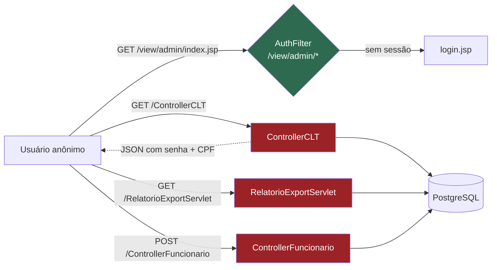
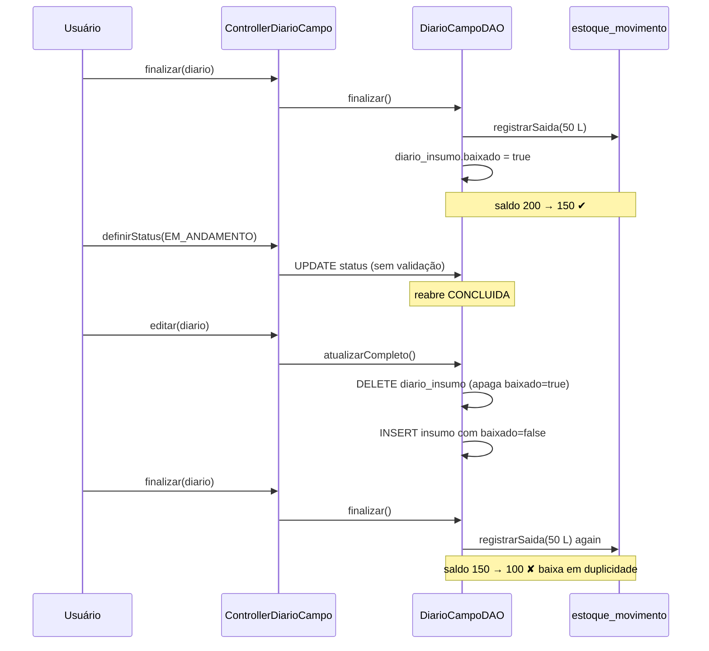
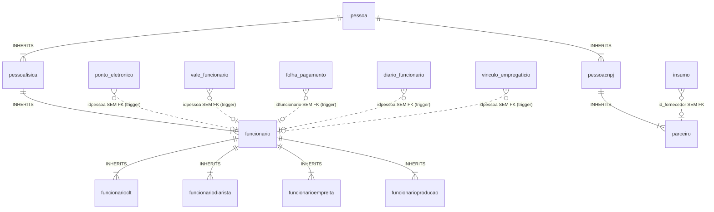

# Auditoria Técnica — Agro Tech One
**Data:** 29/08/2026 · **Escopo:** 13.234 linhas Java (21 servlets, 28 DAOs, 3 services), 38 tabelas PostgreSQL, 5.555 linhas de `main.js`, 24 JSPs
**Objetivo:** levantar erros e bugs existentes **antes** de programar novas funções.

> **Situação em 30/08/2026 — corrigido.** Dos 31 achados (28 desta auditoria mais 3
> descobertos durante a correção), 30 foram corrigidos na branch `fix/auditoria-2026-08`;
> o P1-14 foi mantido por decisão do cliente. Uma revisão adversarial das próprias
> correções encontrou mais 22 defeitos, também corrigidos. O detalhamento está em
> [RELATORIO_CORRECOES_2026-08-30.docx](RELATORIO_CORRECOES_2026-08-30.docx).
> Este documento fica como o registro do diagnóstico original.

---

## Semáforo

| Camada | Situação | Comentário |
|---|---|---|
| Segurança / Autenticação | 🔴 Crítico | API inteira exposta sem login; senhas em texto puro trafegando |
| Persistência (conexões) | 🔴 Crítico | 32 pontos de vazamento; aplicação para sozinha após ~100 operações |
| Confiabilidade de gravação | 🔴 Crítico | 12 métodos gravam "com sucesso" mesmo quando o banco falha |
| Regra de negócio (custos/folha) | 🟠 Alto | Empreita multiplicada, folha sem encargos, regra dos 22 dias divergente |
| Modelagem do banco | 🟠 Alto | Herança de tabelas anula as chaves estrangeiras |
| Front-end / Apresentação | 🟡 Médio | XSS, senha renderizada no HTML, contexto fixo |
| Processo / Build | 🟡 Médio | Flyway não executa, 470 linhas não commitadas |

**Recomendação:** os 5 itens P0 devem ser corrigidos antes de qualquer função nova. Estimativa: 3 a 5 dias.

---

# P0 — Bloqueadores

## P0-1 · A API inteira responde sem autenticação
**Arquivos:** `Filter/AuthFilter.java:16` · `WEB-INF/web.xml` (mapeamentos)

O `AuthFilter` protege apenas `/view/admin/*` — as **páginas**. Os 21 servlets estão mapeados na raiz do contexto (`/ControllerFuncionario`, `/ControllerCLT`, `/RelatorioExportServlet`…), fora do padrão do filtro. Nenhum dos 21 servlets verifica a sessão para autorizar: `getSession()` aparece em apenas 3 arquivos e, nos dois de negócio, **só para carimbar quem registrou** (`ControllerDiarista.java:157`, `ControllerPontoEletronico.java:171`), nunca para barrar.

**Impacto de negócio:** qualquer pessoa com a URL do servidor lê, altera e apaga funcionários, folha, ponto, estoque e safras. Sem login, sem rastro.

```
GET  /agro/ControllerCLT?acao=listar        → lista completa de funcionários
GET  /agro/RelatorioExportServlet?tipo=excel&modulo=folhapagamento&periodo=2026-08
                                            → planilha da folha de pagamento
POST /agro/ControllerFuncionario            → cadastra/altera funcionário
```

**Correção:** trocar o padrão do filtro para cobrir os servlets e negar por padrão.

```java
@WebFilter(urlPatterns = {"/view/admin/*", "/Controller*", "/*Servlet"})
// e, no doFilter, liberar apenas: /login.jsp, /LoginServlet, /CSS/*, /JS/*
```

## P0-2 · Senha em texto puro — no banco, no JSON e no HTML
**Arquivos:** `sql_sistema/agro_banco_completo.sql:650` · `Model/Dao/PessoaDAO.java:14` · `Model/Dao/FuncionarioCLTDAO.java:88` · `Controller/ControllerCLT.java:84` · `view/admin/AtualizarParceiro.jsp:57`

A coluna é `senhapessoa character varying(50)` e o login compara literalmente:

```sql
SELECT ... FROM pessoa WHERE usuariopessoa = ? AND senhapessoa = ?
```

Três vazamentos derivam disso:

1. **JSON** — `FuncionarioCLTDAO` faz `SELECT ... senhapessoa ...` e monta o objeto; `ControllerCLT.java:84` devolve `gson.toJson(lista)`. Como `Pessoa.senhaPessoa` não é `transient`, **a senha e o CPF de todos os funcionários saem na resposta HTTP** — e, por P0-1, sem login.
2. **HTML** — `AtualizarParceiro.jsp:57` renderiza `value="<%= parceiro.getSenhaPessoa() %>"` dentro de um `input type="password"`. O asterisco é só visual: "ver código-fonte" mostra a senha.
3. **Banco** — vazamento do dump expõe todas as credenciais.

Existe `Util/HashUtil.java` (SHA-256) no projeto, usado só para o hash de auditoria do ponto. Está pronto para ser reaproveitado.

**Correção:** migrar para hash com salt (BCrypt), remover `senhapessoa` de todos os `SELECT` de listagem, marcar o campo como `transient`, apagar o `value=` do JSP.

## P0-3 · Credenciais do banco no código-fonte
**Arquivo:** `Util/PostgresConnection.java:16-19`

```java
private static final String URL      = "jdbc:postgresql://localhost:5432/agro";
private static final String USER     = "postgres";
private static final String PASSWORD = "15975328";
```

Está versionado no Git (repositório `siqueira1989/agro`) — quem clonar o histórico tem a senha, mesmo que ela seja trocada depois. Usa ainda o superusuário `postgres`, sem menor privilégio.

Ironicamente, o `EmailUtil.java:42-56` **já faz certo**: lê de `email.properties` com fallback para propriedade de sistema. O padrão existe no projeto e não foi aplicado aqui.

**Correção:** `db.properties` fora do WAR (ou `JNDI DataSource` no Tomcat), usuário de aplicação com permissão restrita, senha rotacionada, `git filter-repo` para limpar o histórico.

## P0-4 · Vazamento de conexões — a aplicação para sozinha
**Arquivos:** `AlimentoDAO`, `ClassificacaoDAO`, `DespesasCustosDAO`, `ParceiroDAO`, `AlimentoClassificacaoDao`

Não há pool de conexões: cada chamada faz `DriverManager.getConnection(...)`, o que abre um **processo real no PostgreSQL**. Mapeamento:

| Arquivo | Aberturas fora de `try-with-resources` | Métodos que **nunca** fecham |
|---|---|---|
| `ClassificacaoDAO` | 7 | 5 (linhas 67, 83, 97, 122, 146) |
| `DespesasCustosDAO` | 7 | 7 (linhas 27, 53, 75, 102, 123, 139, 173) |
| `ParceiroDAO` | 7 | 4 (linhas 17, 151, 255, 347) |
| `AlimentoClassificacaoDao` | 6 | 1 (linha 193) |
| `AlimentoDAO` | 5 | 3 (linhas 75, 97, 115) |
| **Total** | **32** | **20** |

Os 12 restantes chamam `conexao.close()` **dentro do `try`**, antes do `catch` — qualquer exceção pula o fechamento. Exemplo típico (`AlimentoDAO.java:75`):

```java
public void addAlimento(Alimento alimento) throws SQLException {
    Connection conexao = conn.getConnection();   // abre
    try { ... stmt.executeUpdate(); }
    catch (SQLException e) { throw new RuntimeException(...); }
}                                                 // nunca fecha
```

**Impacto:** com `max_connections = 100` (padrão), cerca de 100 operações de cadastro derrubam o sistema com `FATAL: sorry, too many clients already` até o Tomcat ser reiniciado. É o candidato número um para "o sistema travou do nada".

**Correção:** HikariCP (ou `DataSource` JNDI do Tomcat) + `try-with-resources` em todos os 32 pontos.

## P0-5 · Gravações que falham e reportam sucesso
**Arquivos:** `ClassificacaoDAO.java:49-92` · `DespesasCustosDAO.java:50-137` · `AlimentoDAO.java:115`

```java
public void saveClassificacao(Classificacao c) throws SQLException {
    try  { ...ptmt.executeUpdate(); }
    catch (Exception e) {
        e.printStackTrace();
        System.out.println("Erro no cadastro: " + e.getMessage());   // engole
    }
    conexao.close();
}
```

O método declara `throws SQLException` mas **captura tudo e retorna normalmente**. O servlet, sem exceção para tratar, responde `HTTP 200 — "Cadastrado com sucesso!"`. O usuário vê a confirmação; o registro não existe.

Atingidos: `saveClassificacao`, `updateClassificacao`, `deleteClassificacao`, `VerificacaoClassificacao`, `DespesasCustosDAO.create/read/update/delete/listAll`, `AlimentoDAO.VerificarDadosAlimento`.

Agravante: `VerificarDadosAlimento` e `VerificacaoClassificacao` retornam `false` no `catch` — em caso de erro de banco o sistema **conclui que o registro não é duplicado** e segue para o `INSERT`, gerando duplicidade.

**Correção:** remover os `catch` que engolem; deixar a `SQLException` subir e o servlet devolver 500 com mensagem genérica.

---

# P1 — Alto

## P1-6 · Empreita cobrada integralmente em cada atividade
**Arquivo:** `Model/Dao/DiarioCampoDAO.java:214-215`

```java
} else if ("EMPREITA".equalsIgnoreCase(tipo)) {
    custo = valorFixoEmpreita(c, idpessoa);   // valorfixoacordado do cadastro
}
```

`valorfixoacordado` é o valor **do contrato inteiro**. Como o custo é recalculado por linha de `diario_funcionario`, o empreiteiro lançado em 5 atividades custa 5× o contrato. O mesmo vale para o diarista lançado duas vezes no mesmo dia (2 diárias).

**Impacto:** custo por hectare, custo por planta e rateio por talhão da Safra inflados — exatamente os números usados para decidir preço de venda.

**Correção:** ratear o valor da empreita entre as atividades do contrato (ou vincular a empreita a um único diário e bloquear reuso), e travar o diarista em uma diária por pessoa/dia.

## P1-7 · `definirStatus` contorna todas as regras
**Arquivo:** `Model/Dao/DiarioCampoDAO.java:288-293`

```java
public void definirStatus(int idDiario, String status) throws SQLException {
    // UPDATE diario_campo SET status=? WHERE iddiario=?
}
```

Um `UPDATE` cru, sem validar transição, sem recalcular custo, sem baixar estoque. Duas consequências concretas:

1. `PLANEJADA → CONCLUIDA` por essa via mantém o custo **zerado** (`zerarCustos` rodou na criação) e **não baixa o insumo**. A consolidação da Safra, que soma só `status='CONCLUIDA'` (`SafraDAO`), incorpora a atividade com custo 0.
2. `CONCLUIDA → EM_ANDAMENTO` reabre o diário. `atualizarCompleto` (linha 64) então executa `DELETE FROM diario_insumo`, **apagando as linhas marcadas `baixado=true`**. Ao finalizar de novo, o estoque é baixado uma segunda vez pelas mesmas quantidades.

**Correção:** máquina de estados explícita (só transições válidas), e `atualizarCompleto` preservando linhas com `baixado=true`.

## P1-8 · Conexão nova aberta dentro de uma transação aberta
**Arquivo:** `Model/Dao/DiarioCampoDAO.java:455`

```java
Vinculo v = vinculoDAO.buscarAtivo(idpessoa);   // abre OUTRA conexão
```

`recalcularCustos` recebe a conexão `c` da transação em curso, mas `custoHoraCLT` chama um DAO que abre a sua própria. Efeitos: (a) uma conexão extra por funcionário da atividade — some com P0-4 e a exaustão chega rápido; (b) a leitura acontece **fora da transação**, então não enxerga as alterações ainda não comitadas.

**Correção:** sobrecarga `buscarAtivo(Connection c, int idpessoa)` reaproveitando a conexão.

## P1-9 · Folha de pagamento sem encargos legais
**Arquivo:** `Service/FolhaCalculoService.java:74-78`

```java
salarioLiquido = salarioBruto - totalVales
```

Não há **INSS, IRRF, FGTS, DSR, adicional de insalubridade nem 13º**. O valor apresentado como "líquido" não corresponde ao que o trabalhador recebe nem ao que a empresa recolhe.

Além disso, `valorDia = salarioBase / diasUteis` (linha 57): para salário mensal a CLT usa o **divisor 30**, não os dias úteis. Uma falta desconta hoje ≈4,5% do salário em vez dos ≈3,3% devidos — **desconto a maior em toda falta injustificada**, com risco trabalhista.

**Correção:** separar um `EncargosService` com as tabelas vigentes; usar divisor 30 para valor-dia de salário mensal.

## P1-10 · Feriados ignorados no cálculo de dias úteis
**Arquivos:** `FolhaCalculoService.java:106` · `FolhaCalculoRuralService.java:216`

Ambos contam apenas "não é sábado nem domingo" — o próprio comentário admite *"sem feriados"*. Em setembro de 2026 (feriado dia 7) o cálculo usa 22 dias úteis em vez de 21, e o erro se propaga para valor-dia, valor-hora, hora extra, DSR e desconto de falta.

**Correção:** tabela `feriado` (nacional/estadual/municipal) consultada pelo cálculo.

## P1-11 · A mesma regra, três valores diferentes
| Onde | Divisor mensal | Efeito |
|---|---|---|
| `DiarioCampoDAO.java:25` | `DIAS_UTEIS_MES = 22` (fixo) | custo/hora da atividade |
| `DiarioCampoDAO.java:409` (SQL) | `* 22.0` (fixo) | custo de referência na tela |
| `FolhaCalculoService.java:106` | dias úteis reais (20 a 23) | folha do mês |

A hora do mesmo funcionário CLT custa um valor no Diário de Campo e outro na folha. Em fevereiro (20 dias úteis) a diferença chega a 10%.

**Correção:** um único `ParametrosFolhaService` consumido pelas três chamadas.

## P1-12 · Rural: vínculo buscado sempre no dia 1º
**Arquivo:** `Service/FolhaCalculoRuralService.java:56`

```java
Model.Model.Vinculo vinc = vinculoDAO.buscarPorData(id, primeiroDia);
```

Funcionário admitido dia 10 não tem vínculo válido no dia 1º → `vinc == null` → cai no fallback de `funcionarioclt` ou em `BigDecimal.ZERO`. **Folha zerada no mês da admissão.** E não há proporcionalização por dias trabalhados em admissão nem em desligamento — quem trabalha 5 dias recebe salário cheio.

## P1-13 · Rural: "folga compensatória" detectada por ausência de registro
**Arquivo:** `Service/FolhaCalculoRuralService.java:113-120`

A folga é inferida de "existe um dia entre segunda e sábado sem ponto e sem falta". Como quase ninguém tem ponto no sábado, **quase toda semana é classificada como tendo folga** — e o domingo trabalhado deixa de ser pago a 100%, virando dia normal.

**Correção:** registrar a folga explicitamente (campo `folga_compensatoria` no ponto ou tabela de escala), em vez de inferir da ausência.

## P1-14 · Rural: salário integral somado à produção/empreita
**Arquivo:** `Service/FolhaCalculoRuralService.java:180-182`

```java
bruto = salario + extras + adicNoturno + valorProducao + valorEmpreita
```

Nos dias em modo alternativo o código deixa de contar falta e hora extra — mas **não desconta o dia do salário mensal**. O funcionário recebe o dia pelo salário e novamente pela produção. Precisa de confirmação: se for intencional (prêmio por produtividade), documente; se não, é pagamento em duplicidade.

## P1-15 · Detalhe técnico do erro devolvido ao navegador
**Ocorrências:** 14 em `ControllerAlimento`, `ControllerEstoque`, `RelatorioExportServlet` e outros

```java
writeJson(resp, 500, false, "Erro ao atualizar: " + e.getMessage());
```

A mensagem do PostgreSQL — nome de tabela, coluna, constraint — chega ao cliente. Combinado com P0-1, entrega o mapa do banco a quem não está autenticado.

**Correção:** mensagem genérica ao usuário; detalhe apenas no log.

## P1-16 · Login faz varredura completa e aceita usuário duplicado
**Arquivos:** `sql_sistema/agro_banco_completo.sql:649` · `PessoaDAO.java:14`

`pessoa.usuariopessoa` não tem índice nem `UNIQUE`. Como `pessoa` é herdada por 8 tabelas (`pessoafisica`, `funcionario`, `funcionarioclt`, `funcionariodiarista`, `funcionarioempreita`, `funcionarioproducao`, `pessoacnpj`, `parceiro`), **cada login varre as 9 tabelas inteiras**. Pior: dois cadastros podem usar o mesmo login, e o `validarUsuario` devolve o primeiro que aparecer — comportamento não determinístico em quem entra.

**Correção:** `CREATE UNIQUE INDEX ON pessoa (usuariopessoa)` — atenção, com herança o índice precisa ser replicado em cada tabela filha; é mais um sintoma de P2-17.

---

# P2 — Médio / Débito técnico estrutural

## P2-17 · Herança de tabelas anula a integridade referencial
**Arquivo:** `sql_sistema/agro_banco_completo.sql` — 9 cláusulas `INHERITS`

No PostgreSQL, **chave estrangeira e restrição UNIQUE não atravessam a herança**: uma FK para `pessoa(idpessoa)` não enxerga as linhas de `funcionario`. É por isso que existem **16 triggers `chk_func_exist` e 5 triggers `casc_del_func`** — reimplementando à mão o que o banco faria sozinho.

O resultado aparece nos números: **38 tabelas, apenas 18 FKs e 1 CHECK**. Nenhuma das 16 tabelas que guardam `idpessoa` (ponto, folha, vale, falta, pagamento, diário, empreita, produção, vínculo) tem FK de verdade. `insumo.id_fornecedor` também ficou sem FK, porque `parceiro` herda `pessoa`.

**Riscos:** órfãos quando um trigger falha ou é desabilitado; `idpessoa` duplicado entre `funcionarioclt` e `funcionariodiarista` (a PK não é herdada); planos de execução ruins.

**Correção (médio prazo):** achatar para uma tabela `pessoa` única com discriminador de tipo + tabelas satélite 1:1 com FK real.

## P2-18 · Migrations que ninguém executa
`src/main/resources/db/migration/` segue a convenção Flyway (V2…V19) mas **Flyway não está no `pom.xml`** e o `V1__` não existe. Os scripts são aplicados manualmente, sem controle de quais já rodaram — a origem mais comum de "funciona na minha máquina".

## P2-19 · Configuração morta que pode quebrar o deploy
`src/main/resources/META-INF/persistence.xml` declara `<class>Model.Model.tipo</class>` — **classe inexistente**. Se algum dia o JPA for inicializado, o contexto não sobe. `JakartaRestConfiguration` e `JakartaEE10Resource` são andaimes do NetBeans, sem uso. A tabela `registroponto` não é referenciada por nenhuma linha de Java (substituída por `ponto_eletronico`).

## P2-20 · Sem logging: 38 `printStackTrace()`
Espalhados por 15 arquivos, incluindo `TransacaoUtil.java` (que imprime a falha do rollback e segue). Sem nível, sem timestamp correlacionável, sem arquivo próprio — tudo cai no `catalina.out`. Diagnosticar um erro relatado pelo usuário fica inviável.

## P2-21 · Encoding ausente em dois servlets
`ControllerPontoEletronico` e `RelatorioExportServlet` não chamam `setCharacterEncoding("UTF-8")` no request. Acentuação em observação/justificativa chega corrompida (`Ação`).

## P2-22 · XSS armazenado
`AtualizarParceiro.jsp` usa `<%= %>` sem escape em 16 atributos: um parceiro cadastrado como `" onfocus=alert(1) autofocus x="` executa script para o próximo usuário que abrir a tela. `main.js:2320` concatena `nome` vindo do banco dentro de `.html()`. **Correção:** JSTL `<c:out>` ou `fn:escapeXml`, e `.text()` no lugar de `.html()`.

## P2-23 · Contexto `/agro` fixo no código
`main.js` chama `/agro/ControllerAlimento` em URL absoluta e `META-INF/context.xml` fixa `path="/agro"`. Publicar como ROOT ou com outro nome quebra todas as chamadas AJAX. **Correção:** `${pageContext.request.contextPath}` numa variável global do JS.

## P2-24 · `main.js` com 5.555 linhas
Um arquivo único concentra todos os módulos. Toda alteração carrega risco de regressão em telas não relacionadas — foi exatamente o que aconteceu no commit `3bb7aac` (IDs duplicados entre modais).

## P2-25 · Traduções do DataTables inconsistentes
Três URLs de i18n coexistem: `1.11.5/pt-BR.json`, `1.11.5/pt_BR.json` e `2.1.6/pt-BR.json`. A variante com underscore não existe no CDN — a tabela que a usa cai para os rótulos em inglês. Fixar uma versão única.

## P2-26 · Ponto sem virada de dia validada
`Service/CalculoPontoRural.java:66` trata `saída < entrada` como virada de meia-noite e soma 24 h. Um erro de digitação (entrada 17:00, saída 08:00) vira **15 horas trabalhadas** sem nenhum aviso, gerando 7 h extras indevidas.

## P2-27 · Ponto registrado sem autor
`ControllerPontoEletronico.java:171-177`: sem sessão, `registradoPor` fica nulo e o registro é gravado assim mesmo. O projeto cita a Portaria 671 do MTE (ver `HashUtil`), que exige rastreabilidade — um ponto sem autor não sustenta a auditoria.

## P2-28 · 470 linhas não commitadas
11 arquivos modificados (`ControllerDiarioCampo`, `DiarioCampoDAO`, `SafraDAO`, `main.js`, 3 JSPs) e 2 migrations novas (`V18`, `V19`) fora do Git. Trabalho sem backup e sem revisão, potencialmente já em produção.

---

# Diagramas

## Exposição atual da API



## Dupla baixa de estoque via `definirStatus`



## Herança vs. integridade referencial



---

# Plano de correção sugerido

### Onda 1 — Contenção (2 a 3 dias) · faça antes de qualquer função nova
1. `AuthFilter` cobrindo os servlets, com negação por padrão · **P0-1**
2. Pool de conexões (HikariCP/JNDI) + `try-with-resources` nos 32 pontos · **P0-4**
3. Remover os `catch` que engolem exceção nos 12 métodos · **P0-5**
4. Credenciais para arquivo externo + rotação da senha do banco · **P0-3**

### Onda 2 — Dados sensíveis (1 a 2 dias)
5. BCrypt no login; tirar `senhapessoa` dos `SELECT` e do JSON; limpar o `value=` do JSP · **P0-2**
6. Mensagens de erro genéricas ao cliente · **P1-15**
7. Escape nos JSPs e `.text()` no `main.js` · **P2-22**

### Onda 3 — Regras financeiras (3 a 4 dias)
8. Rateio da empreita e trava de diária por pessoa/dia · **P1-6**
9. Máquina de estados do diário + preservar `baixado=true` · **P1-7**
10. `ParametrosFolhaService` único (divisor 30, feriados, dias úteis) · **P1-10, P1-11**
11. Vínculo pela data do fechamento + proporcionalização · **P1-12**
12. Folga compensatória explícita · **P1-13**

### Onda 4 — Estrutura (planejar, não urgente)
13. Logging estruturado no lugar dos 38 `printStackTrace` · **P2-20**
14. Flyway no `pom.xml` com baseline · **P2-18**
15. Modularizar o `main.js` e parametrizar o contextPath · **P2-23, P2-24**
16. Estudo de migração da herança de tabelas para FK real · **P2-17**

### Antes de tudo
Commitar ou descartar as 470 linhas pendentes (`git status`) — corrigir sobre uma base indefinida gera conflito garantido. · **P2-28**
